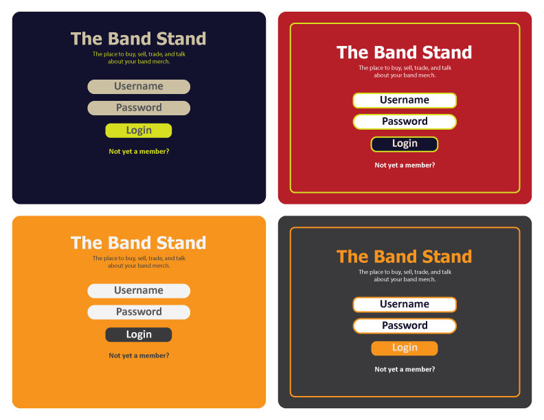
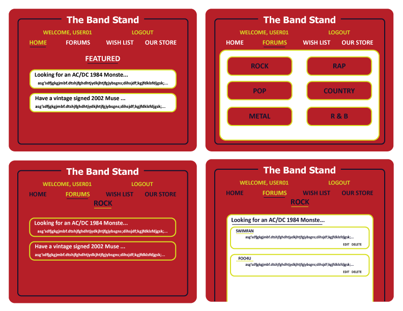
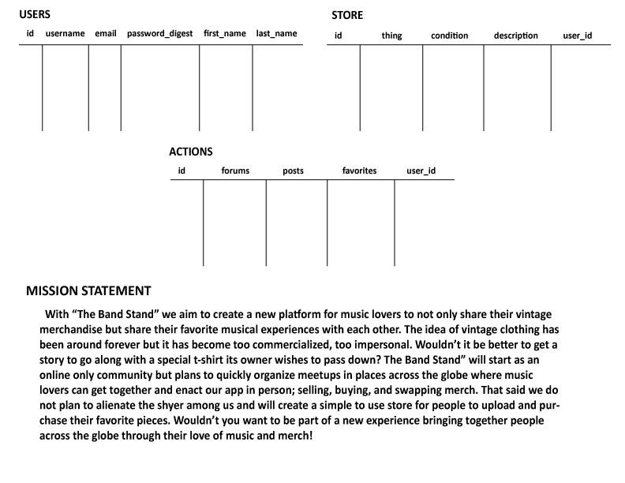

 Alexander Calleia

# The Band Stand

## What is the Band Stand?

With "The Band Stand" I aim to create a new platform for music lovers to not only 
share their vintage merchandise but share their favorite musical experiences with 
each other. The idea of vintage clothing has been around forever but it has become
too commercialize, too impersonal. Wouldn't it be better to get a story to go along 
with a special t-shirt its owner wishes to pass down? "The Band Stand" will start as 
an online only community but plans to quickly organize meetups in places across the 
globe where music lovers can get together and enact our app in person; selling, 
buying, and swapping merch. That said we do not plan to alienate the shyer among us
and will create a simple to use store for people to upload and purchase their favorite 
pieces. Wouldn't you want to be part of a new experience bringing together people across
the glove through their love of music and merch!

## Wireframe

##     
##  
##  

## Initial thoughts on hurdles

I expect many problems.

## Phases of Completion

Phase 0 - Forum Setup
    
    Create a functional forum:
        Login, logout, forums, threads, posts.

Phase 1- Making things work
    
    Authenticate who is posting who can delete what.
    Add Meetup API so users can create swap meets. 

Phase 2- Bonus

    Create Store Front.
    Add API for pictures.

## Sample Code
    
    const express = require('express');
const threadsRouter = express.Router();

const authHelpers = require('../services/auth/auth-helpers');
const threadsController = require('../controllers/threads-controller');
const postsController = require('../controllers/posts-controller');

threadsRouter.get('/', authHelpers.loginRequired, threadsController.index);

threadsRouter.get('/:threadId', authHelpers.loginRequired, threadsController.newShow, threadsController.show);
threadsRouter.get('/:threadId', authHelpers.loginRequired, threadsController.show);

threadsRouter.get('/:threadId/posts/new', authHelpers.loginRequired, (req, res) => {

  res.render('posts/post-add', {user: req.user.id, threads_id: req.params.threadId, posts: req.body.posts});
});

threadsRouter.post('/:threadId', authHelpers.loginRequired, postsController.create);
threadsRouter.get('/:threadId/posts/:postId/edit', authHelpers.loginRequired, postsController.edit);
threadsRouter.put('/:threadId/posts/:postId', authHelpers.loginRequired, postsController.update);
threadsRouter.delete('/:threadId', authHelpers.loginRequired, threadsController.delete);
threadsRouter.delete('/:threadId/posts/:postId', authHelpers.loginRequired, postsController.delete);

module.exports = threadsRouter;

## Links and Resources

Big thanks to:

Ryan Edwards &
Philip Zak

